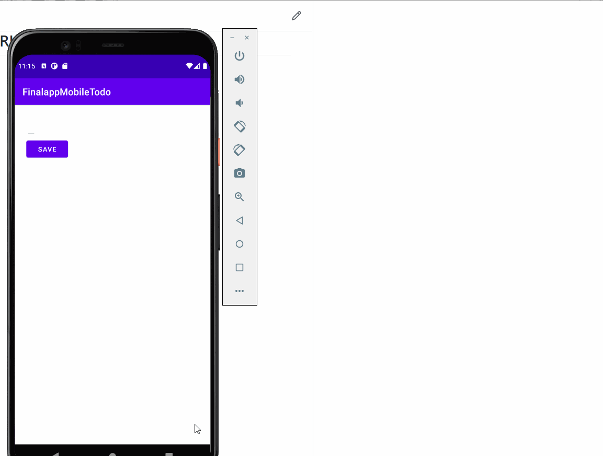
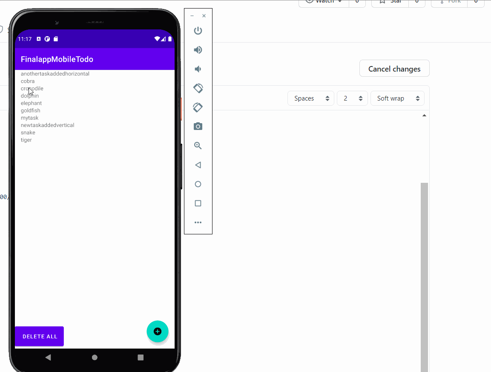
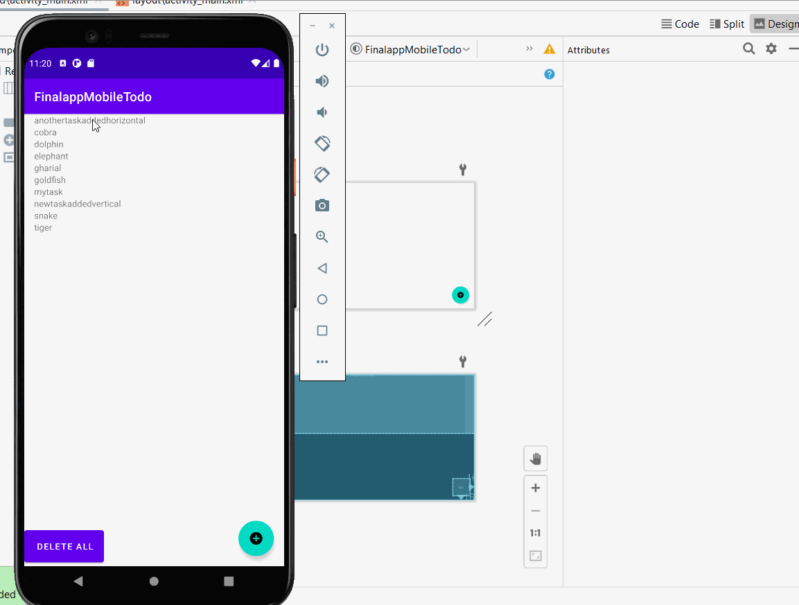
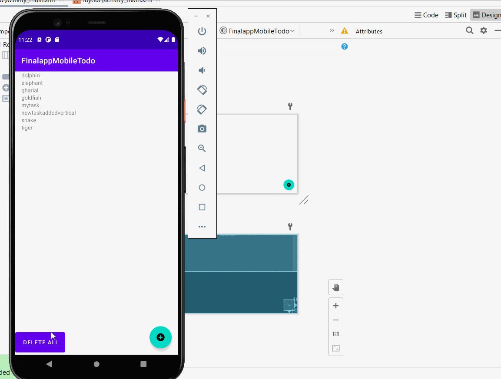

# FinalappMobileTodo

## TODO-App  Overview

- Application Main Index (Potrait)

- Application Main Index (Landscape)

- Application Add Index 

- Application Edit Index 

- Application DeletedList-Fragment Index 

## TODO-App Application Workings (CRUD Functions)

- Add Function working

- Edit FunctionFunction 

- Delete Function 

- Deleteall Function 

